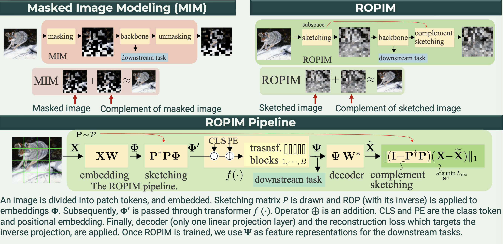

# ROPIM: Pre-training with Random Orthogonal Projection Image Modeling
ROPIM is a self-supervised learning technique based on count sketching, which  reduces local semantic information under the bounded noise variance. While  Masked Image Modelling (MIM) introduces Binary noise, ROPIM proposes a _continous_ masking strategy. 
Continuous masking allows for larger number of masking patterns compared to binary masking.



## Citation

If you find our work useful for your research, please consider giving a star :star: and citation :beer::

```bibtex
@inproceedings{
haghighat2024pretraining,
title={Pre-training with Random Orthogonal Projection Image Modeling},
author={Maryam Haghighat and Peyman Moghadam and Shaheer Mohamed and Piotr Koniusz},
booktitle={The Twelfth International Conference on Learning Representations},
year={2024},
url={https://openreview.net/forum?id=z4Hcegjzph}
}
```
## Usage

Setup conda environment and install required packages:
```bash
# Create environment
conda create -n ropim python=3.8 -y
conda activate ropim

# Install requirements
conda install pytorch==1.10.1 torchvision==0.11.2 torchaudio==0.10.1 cudatoolkit=11.3 -c pytorch -c conda-forge

# Clone ROPIM repo
git clone https://github.com/csiro-robotics/ROPIM
cd ROPIM

# Install other requirements
pip install -r requirements.txt
```
### Pre-training with ROPIM
For pre-training models with `ROPIM`, run:
```bash
python -m torch.distributed.launch --nproc_per_node <num-of-gpus-to-use> main_ropim.py \ 
--cfg <config-file> --data-path <imagenet-path>/train [--batch-size <batch-size-per-gpu> --output <output-directory> --tag <job-tag>]
```
### Fine-tuning pre-trained models
For fine-tuning models pre-trained by `ROPIM`, run:
```bash
python -m torch.distributed.launch --nproc_per_node <num-of-gpus-to-use> main_finetune.py \ 
--cfg <config-file> --data-path <imagenet-path> --pretrained <pretrained-ckpt> [--batch-size <batch-size-per-gpu> --output <output-directory> --tag <job-tag>]
```

## Acknowledgement

This code is built using the [timm](https://github.com/huggingface/pytorch-image-models) library, the [BEiT](https://github.com/microsoft/unilm/tree/master/beit) repository and the [SimMIM](https://github.com/microsoft/SimMIM) repository.
